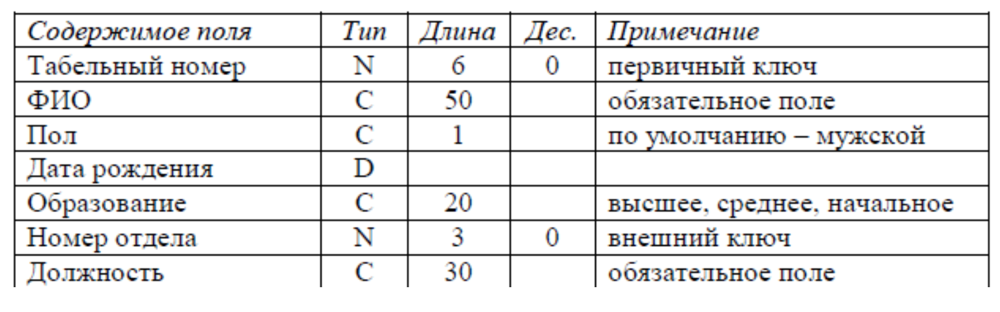

## No1. Создание и заполнение таблиц (отношений).

1. Отношение "Отделы" ("Номер отдела", "Название отдела"). 
2. Отношение "Сотрудники" (основное):

3. Отношение "Дети" (внешний ключ к отношению "Сотрудники", "Имя", "Дата рождения").

## No2. Выборка данных.
  Создать упорядоченные списки:
1. Сотрудников с детьми от 3 до 12 лет включительно;
2. Отделов, в которых нет сотрудников;
3. Посчитать количество сотрудников с разными уровнями образования;

## No3. Работа с представлениями.
  Создать представления:

1. "Отделы и сотрудники" (поля обоих отношений без повторов);
2. "Бездетные сотрудники" (все поля отношения "Сотрудники");
3. "Образовательный уровень сотрудников" (уровень образования, количе- ство мужчин, количество женщин);

